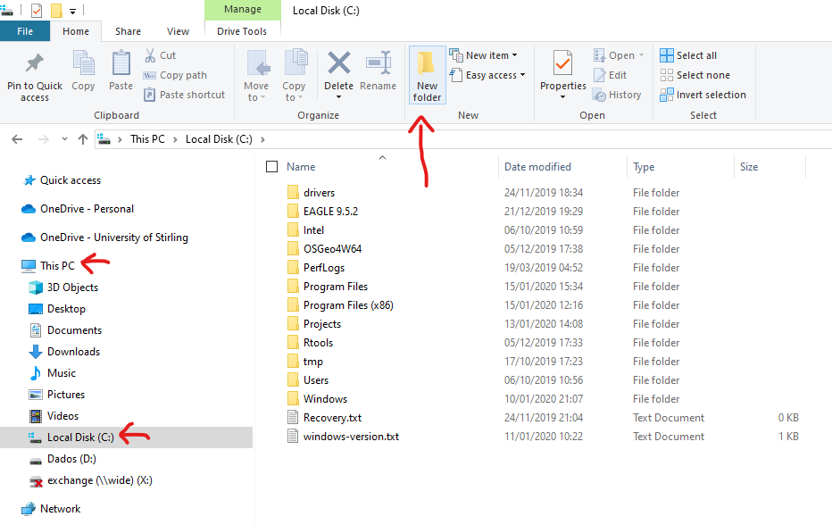
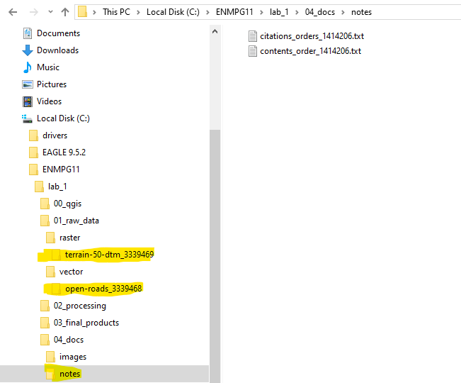

---
output:
  html_document: default
---
# Lab 1 - QGIS overview and file management {#lab1}

```{r setup, include=FALSE}
knitr::opts_chunk$set(echo = FALSE)
```

## Guided Exercise 1 - A simple GIS workflow {#GE1}

The purpose of this exercise is to give you a general overview of proper GIS workflow, from start to end. Throughout the module, your exercises and projects wil become more complex, but the general workflow will not change. Getting used to having proper project and file management habits from the start is the **best** thing you can learn. Speaking as someone whi has been teaching and working with Geomatics for more than a decade, poor file/project managemnt is the underlying cause of at least 50% of the GIS problems you may encounter.

### 1 - Creating a project structure

GIS projects generate a lot of different files quickly, so project organization is **essential**. The steps below are my suggestion for organizing GIS projects files and associated data. Once you get comfortable managing your own projects, feel free to change the proposed structure to something that best suits your own workflow. 

1. Create a folder on your computer called `ENMPG11`, off of the main data drive. For **Windows**, this will be `C:` in most cases, unless you have separate disk drives. For **Linux** and **Mac**, create it on you `home` drive. 





```{block2 type='rmdimportant'}
- Having complex file paths is a major source of problems. That is why we keep our main projects folder off a base folder.

- **NEVER** use spaces or special symbols on your folder and file names. Limit yourself to using letters A-Z and a-z, numbers 1-9 and just the *underline* (_) and *dash* (-) symbols. 

- Remember that linux and Mac OS systems differentiate between upper and lower case letters, so 'Filename.txt' and 'filename.txt' are considered different. Windows **does not** differentiate cases, so the examples abovw would overwrite each other when saving.
```

2. Inside the ENPG11 folder, create a subfolder called `lab_1`

3. Inside `lab_1`, create the following folder structure:


This is the most "barebones" project structure you can have. The folders will bee used as follows:

- `00_qgis`: we will use this folder to save our QGIS project files.

- `01_raw_data`: this folder will keep all the original data files you are working with. This way you can always go back to the start if something goes wrong. We use the subfoldrrs `vector` and `raster` to easily know which data type we are working with. You should create additional subfolders inside each folder to keep things organized as you go.

- `02_processing`: here we will keep all th  files you generate as part of your work. Make ample use of subfolders to identify each step of the workflow.

- `03_final_products`: here we will keep the final products of our intended analysis. This makes it easy for us to find the latest version of our intended outputs, without risking using intremediate files instead

- `04_docs`: here we will keep all our *non-GIS* files. In the `notes` folder, you can keep a simple text file documenting the project steps as you work in it. You can also keeo important referece images here. In `images`, you can save any image that illustrates the steps you made, or maps you have produced. You can add other subfolders such as `report` if you are writing a report about your project, and keep the report file in there.

3. Organize the data you've downloaded previosuly during the instructor-led QGIS exploration into your projec folder. The terrain data folder goes into `raster`, the roads data goes into `vector`, and the `.txt` metadata files go into `docs/notes`. You can keep the data into the originalfolders they came in, for easy identification: 




### 2 - Creating a QGIS project

A QGIS project is an *index* file that will remember all the data layers you have loaded, their stacking order, the styling of each layer, and some other information, such as a default map projection and datum. It will also keep any map layouts that you create.

- Create a new project in QGIS by clicking on `Project > New...` or pressing *Ctrl-N*:

```{R qgisproj1,  out.width = "75%", fig.align = 'center', echo=F}
knitr::include_graphics(rep("images/lab1_fig1_newproject.png"))
```

- Add the layers `NS_RoadLink.shp` and `NS89.asc` from your organized  project folder (terrain and roads) to your project.

- Save your project. Click on the Save button and give your project a name, nd save it on `ENMPG11/lab_1/00_qgis`.

- Open the project settings by clicking on `Project > Properties...`. You will see this window:

```{R qgisproj2,  out.width = "75%", fig.align = 'center', echo=F}
knitr::include_graphics(rep("images/lab1_fig2_projprops.png"))
```
- The main thing to set on your new project are the project home folder, the base map projection info and the measurement units. 

  - For the project home on the `General` tab, select the `lab_1` folder. This helps navigating when opening and saving data.
  
  - For measurement units, make sure distance units are set in meters, and area units in squared meters, also on the `General` tab. 
  
  - For base projection, go to the `CRS` tab and search for **OSGB 1936 British National Grid**, identified by the *EPSG code* 7405. EPSG stands for "European Petroleum Survey Group", and designates a parameter database with standard codes for geodesic information. Over time, you will propbably memorize the EPSG codes for the projections you use more often, making it easy to search for  Select it by clicking on it.
  
- Save your project by clicking on the *Save* button, or going to `Project > Save`, or by typing `Ctrl+S` simultaneously.
  
### 3. Styling your layers and producing a simple map

1. Select the `NS89` layer on the *Layers* side panel, and drag it to the bottom if not already. 

2. Turn the roads layer off for now.

3. Right-click on the layer name and choose `Rename layer`. Rename it to `Digital Elevation Model (50m)`. Open the file exlplorer in your system, and look for the `NS89.asc` file you have saved before.

**Stop and think:** wil changing a layer name in the layer panel also change the name of the source data file for that layer?

4. Right clik on the terrain layer and choose `Zoom to Layer`. This is always a handy tool to "find yourself" if you end up zooming or panning the map too far. Pick a layer that covers most of your intended work area and zoom to it. (Advanced: you can also set a *Spatial Bookmark* by going to `View > New Spatial Bookmark...(Ctrl + B)`. You bookmarks will show on your *Browser* side panel, below your *Favorites*). 

5. Right click on the terrain layer name and select `Properties...`, then go to the `Symbology` tab. Select `Rendering type` to be `Single Band Pseudocolor`, and `Color Ramp` as `spectral`. Click again on the down arrow button to the right of the `Color Ramp` box, and select `Invert Color Ramp`, so that the minimum heights are colored blue. Then click `Ok`. Save your project.

6. Rename the `NS_RoadLink` layer to `Road Network`. Go to its Symbology properties and click on `Simple Line`. Change the line color to a mid-grey, and the line width to 0.3. Click `Ok`. Reactivate the layer to visualise it.

7. Go to the `Vector` menu and select `Research Tools > Extract Layer Extent...`. Select the terrain layer as your `Input layer`, and click `Run` to generate a *temporary layer*. This layer will not be kept once you close QGIS, unless you save it manually later. **The window will not close automatically** once you run, so remember to click on `Close` when you are done.

8. Go to `Vector > Geoprocessing Tools > Clip...`. Select the roads layer as the `Input Layer` and the new temporary layer as the `Overlay Layer`. This time, we will save the output. Click on the `...` button to tle right of the `Clipped` box, and then choose `Save to file`. Save your new layer on `ENMPG11/lab_1/procs=essing`, naming it `clipped_roads.shp`. Make sure the `SHP file` format is selected below the file name.

9. Tur off the original roads layer on and off to see the result of your operation. Then right-click on the original roads layer, and select `Styles > Copy Style > All Style Categories`. Then right click on the new (clipped) roads layer and select `Styles > Paste Style > All Style Categories. Remove the original roads layer from your project and save the project. Close QGIS. 
**Stop and think:** what does the warning given by QGIS when you try to close it means?

10. Reopen QGIS, and load back your project. Notice it is exaclty as you last saved, including zoom level. If the "Extent" layer still shows on the side panel, remove it.

11. Click on `Project > New Map Layout` and name it `Lab 1 Layout`. A new window will open with the QGIS Layout Editor.

12. Add a new map to the layout by clicking on the  icon. Drag it through the page so it covers about 2/3 of it horizontally, and the full page (minus borders) vertically.

13. Use the `Interactive Extent` tool !´[(https://docs.qgis.org/testing/en/_images/mActionMoveItemContent.png) to pan and zoom until your data uses most of the map area. Make sure you are not hiding the edges of your map area with too much zoom!


14. Now fine tune the map scale by changing the `Scale` value on the right panel. Remember that this value means "1:value", meaning 1 unit on the page is equal to that many units (value) in the real world. This means larger numbers will "zoom out", and smaller numbers will "zoom in". Try to make the map fill as much as possible of the map box.

15. Go to the menu `Add Item > Add Legend...` (notice the icon for this option, and find it on the side toolbar). Click the area beside the map box and drag to add a legend. Go back to the main QGIS window, right click on the terrain layer name, and on the `Symblogy` tab, change the `Mode` under the class color box to `Equal Interval`, and select the number of `Classes` to 10 (to the right of the `Equal Interval` box.
