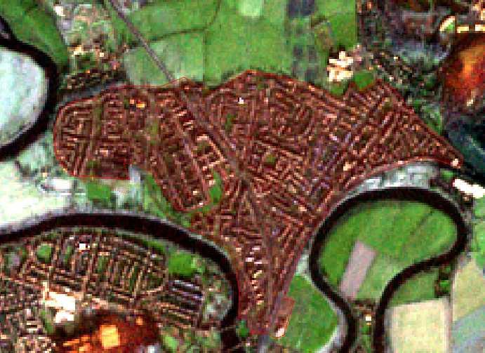

---
output:
  html_document: default
---
# Lab 11 - Satellite Image Manipulation and Classification {#lab11}

This exercise is about extracting inmformation from satellite images using both manual and automated methods. We will use the same Sentinel-2B MSI level 2A image that was used in the previous lab, so go ahead and redownload it if you need to.

```{block type='rmdimportant'}
**Stop and think:** 

- What is the meaning of a) Sentinel-2B, b)MSI, c) level 2A?

- What was the acquisition (i.e. actual imaging) date of the image?
```

## Image band stacking and clipping

The European Space Agency distributes Sentinel images as individual band files, which prevents us from doing much with them. So the first step is to stack all the bands in a single file. For that, we will use the "virtual raster" function provided by the GDAL library. This creates a small text file that points to the individual bands and "tricks" QGIS and other software into seeing the individual files as a single file. The advantage is that no data needs to be copied/duplicated, as it would be the case if we were to create a new multiband-GeoTIFF.

- Remember that the actual images will be on `S2B_MSIL2A_20200118T113319_N0213_R080_T30VVH_20200118T123429.SAFE\\GRANULE\\L2A_T30VVH_A014978_20200118T113437\\IMG_DATA\\`, and this root folder will be on the location that you extracted your zip file. Inside this folder,there will be three folders called `R10m`, `R20m` and `R60m`. 

- From `R10m`, load bands `2`,`3`,`4`, and `8`; from `R20m`, load bands `5`, `6` , `7`, `8A`, `11` and `12`.

- Order the bands in increasing order on your layer panel, and then go to `Raster > Miscellaneous > Build Virtual Raster...`. On `Input Layers`, click on the `...` bot to the right and select all layers for inclusion. Set resolution to `highest`, and `Run` it to produce a temporary file. It weill be called `virtual`. Remove the original layers from the project to keep it tidy.


- Load the `ROI.shp` file (ROI stands for Region of Interest) and use it as a **Mask Layer** to clip the virtual raster, as you have already learned. This time, do save the file as a named **Geotiff** file, using the name `S2B_MSIL2A_2020_01_18_T30VVH.tif`.

```{block type='rmdimportant'}
**Stop and think:** 

- What metadata are we encoding in this file name?

```

- Remember the ordering of the bands in your new file: 

- Band 1: B2_Blue_492nm
- Band 2: B3_Green_560nm
- Band 3: B4_Red_665nm
- Band 4: B5_Rededge_704nm
- Band 5: B6_Rededge_740nm
- Band 6: B7_Rededge_780nm
- Band 7: B8_NIR_833nm
- Band 8: B8A_NIR_864nm
- Band 9: B11_SWIR_1610nm
- Band 10:B12_SWIR_2186nm

## Color composition

- Now, try a few color compositions. Remember that water will reflect mostly in the visible bands, vegetation on the NIR bands, and soils and man made features on the SWIR bands. To do that, go to `Properties > Symbology...`, and select the option `Multiband color`. 

- To change the contrast of your image, expand the `Min / Max Value Settings` box, and try different methods. `Cumulative count cut` will ignore the bottom and top $x$% pixels of the pixel value distribution (i.e. quantiles), while `Mean +/- stabdard deviation x` will assume a normal distribution and cut based on the standard deviation. On the figure below, the plot to the left shows the cutoffs for 2% and 98% percentiles , and the left plot shows the cutoffs for mean (dashed) plus or minus 2x the standard deviation.

```{r stretch, cache=T, fig.height= 4, fig.width=10, message=F, warning=F, echo=F}
library(ggplot2)
library(patchwork)
set.seed(1979)
x <- data.frame(DN = rlnorm(1000,2.10,1.7) + rnorm(1000,0,10))
x[x < 0 | x > 255] <- NA
mx <- mean(x$DN, na.rm=T)
sdx <- sd(x$DN, na.rm=T)
p02 <- quantile(x$DN,probs = 0.02, na.rm=T)
p98 <- quantile(x$DN,probs = 0.98, na.rm=T)

p1 <- ggplot(x,aes(DN)) + geom_histogram() +
  geom_vline(xintercept=c(p02,p98), color='red') 
  
p2 <- ggplot(x,aes(DN)) + geom_histogram() +
  geom_vline(xintercept=c(mx-2*sdx,mx+2*sdx), color='red') +
  geom_vline(xintercept=c(mx), color='red', linetype = "dashed")


p1 + p2  
```

## Manual digitazion

The most reliable way to delimit surface objects on images is still the human brain (the ultimate neural network). However, it can be time consuming and/or costly to have it done manually. Still, it is an important skill to know, especially if you need highly accurate information for small areas.

- The first and most important thing to set is the mapping scale. If you keep zooming in and out during manual digitization, the level of detail of the resulting polygons will also vary. SO you need to decide on a mapping scale. Usually, it is the best "zoom" achievable for the image in question without it looking pixelated. For our sentinel image, it is around 1:15000. Type that scale on the bottom bar. You should not zoom in or out while digitizing, until you are done.

- The second very important thing to set is the `snap` setting. This controls how close polygon lines can get beforfe they snap together. Remember that we need vector files with proper topology, so we should not duplicate polygon boundaries and create slivers. Right click an empty space on the top toolbar and enable the `Snapping toolbar`. Then, on the toolbar, click on the magnet icon to enable snapping, and then set the following options: `All layers` (second button), `Vertex and segment` (third button) and 15 meters for snapping (boxes).

- Now create a new empty vector layer by clicking on the  button. Name it "land_cover.shp", select `Polygon` as the `Geometry type`, and on the `New Field` section, create a new field named `land_cover`, of the `text data` format and add it to the list. Click `Ok`.

```{block type='rmdimportant'}
**Stop and think:** 

- Look at your image and decide on which land cover classes (i.e. the classification legend) are present. Write them down for reference.

```

- Pick a first land cover class., for example, urban. Turn layer editing on for the land_cover layer (and make sure it is on top on the layer panel), and select the `Add polygon feature` tool ().

- Pan the map, without changing the scale, until you see a patch of urban area. Click on the edge of the area and trace its outline as best as you can, by consecutively clicking around the edges. It should look like the figure below when you are about to finish. 





- When you are done, right click, and then fill the attributes `id` = `1` and `land_cover` = `Urban`. Your first digitized polygin should now be done. If you feel the need to fix a few segment sof the polygon edge, use the `Vertex tool` (). Click on the polygon to select it, and then click once on the vertex you want to edit, then drag it to new position and click again.

- Now pick another patch of any class, immediately adjacent to the one you just digitized. Start digitizing it, and notice how, when you approach the edge of the previous polygon, the mouse pointer just snaps to it, showing a pink indicator. That ensures you are not creating double edges.

- Keep mapping until you have full coverage of the ROI. Repeat the same `id` for all urban areas, and use different ids for different classes.

## Automatic classification

To perform automatic classification, we need dedicated remote sensing sofware. In this case, we will use Orfeo Toolbox, a toolset developed by the National Centre for Space Studies (CNES) in France. Head to https://www.orfeo-toolbox.org/ and download the latest version. It comes as a zip file, that can be extracted and used anywhere.

Please follow along the guided demo during the lab. The demo will be recorded for future access.


